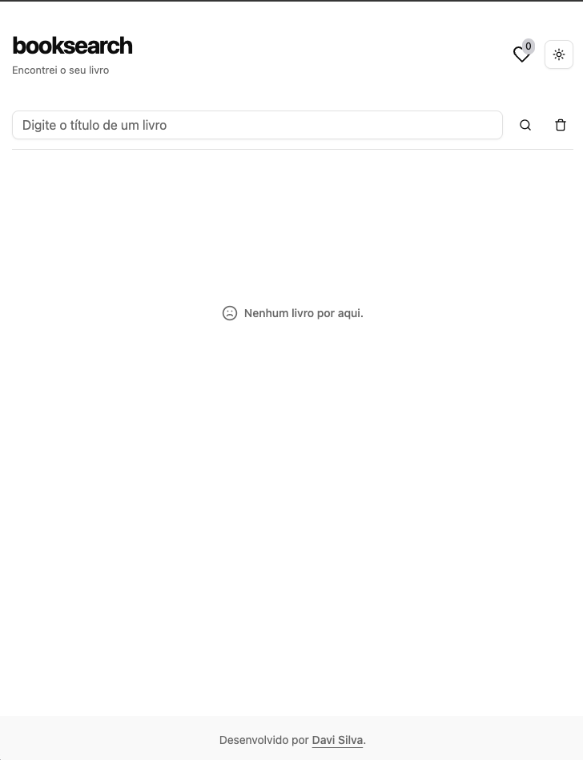

<h1 align="center">BookSearch</h1>

<p align="center">
  <a href="#dart-about">About</a> &#xa0; | &#xa0; 
  <a href="#sparkles-features">Features</a> &#xa0; | &#xa0;
  <a href="#rocket-technologies">Technologies</a> &#xa0; | &#xa0;
  <a href="#white_check_mark-requirements">Requirements</a> &#xa0; | &#xa0;
  <a href="#checkered_flag-starting">Starting</a> &#xa0; | &#xa0;
  <a href="#memo-license">License</a> &#xa0; | &#xa0;
  <a href="https://github.com/{{YOUR_GITHUB_USERNAME}}" target="_blank">Author</a>
</p>

<br>

## :dart: About

BookSearch is a web application that allows users to search for books using the Google Books API. Users can view a list of related books, mark them as favorites, and see more details about each book in a modal. The number of favorited books is displayed in the header next to the theme toggle.

## :sparkles: Features

:heavy_check_mark: Search for books using the Google Books API;\
:heavy_check_mark: View a list of 10 related books;\
:heavy_check_mark: Favorite and unfavorite books;\
:heavy_check_mark: Display the total number of favorited books in the header;\
:heavy_check_mark: Open a modal to view more book details;\
:heavy_check_mark: Toggle between light and dark themes.

## 📸 Screenshots

### Clean Interface



### Book List After Search


### Dark Mode


### Favorites and Modal Open


## :rocket: Technologies

The following tools were used in this project:

- [Vite](https://vitejs.dev/)
- [React](https://reactjs.org/)
- [TypeScript](https://www.typescriptlang.org/)
- [Tailwind CSS](https://tailwindcss.com/)
- [shadcn/ui](https://ui.shadcn.dev/)

## :white_check_mark: Requirements

Before starting :checkered_flag:, you need to have [Git](https://git-scm.com) and [Node](https://nodejs.org/en/) installed.

## :checkered_flag: Starting

```bash
# Clone this project
$ git clone https://github.com/{{YOUR_GITHUB_USERNAME}}/booksearch

# Access
$ cd booksearch

# Install dependencies
$ yarn

# Run the project
$ yarn dev

# The server will initialize at <http://localhost:3000>
```
